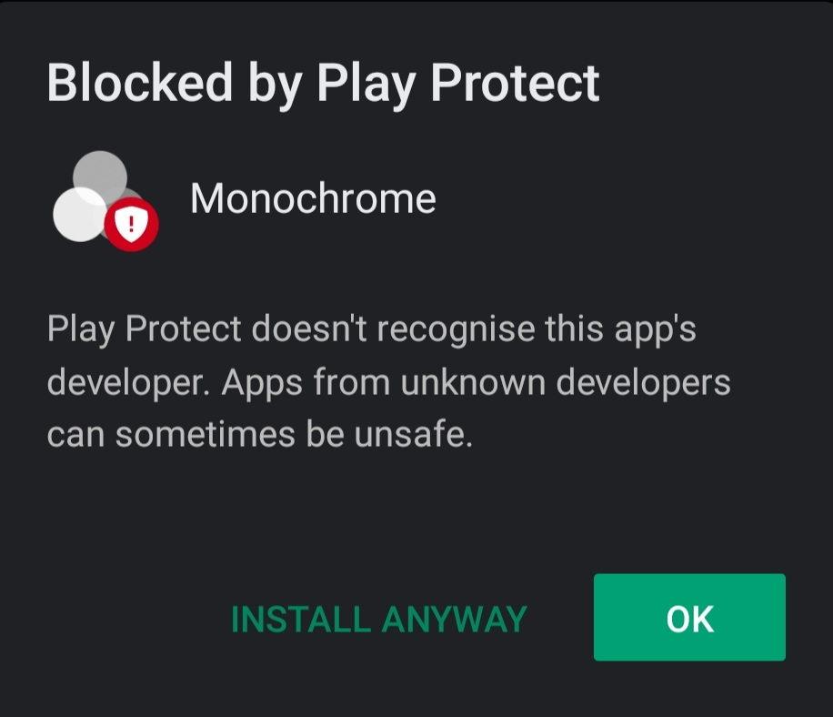
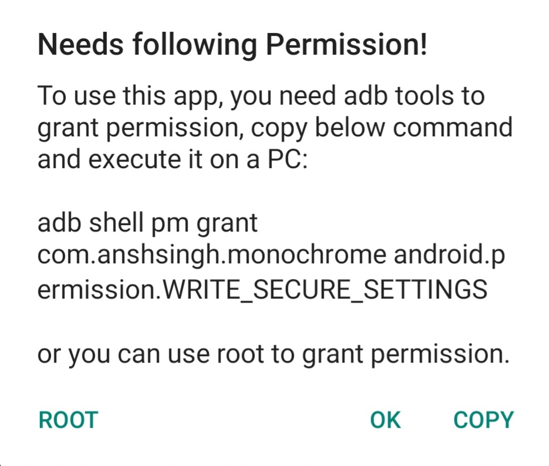
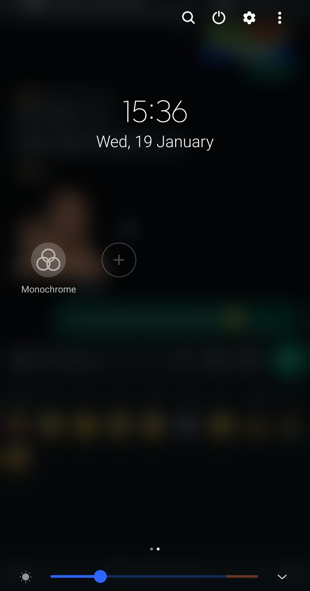

# Monochrome

Simple android app to enable Monochromacy/Greyscale mode through quick settings toggle.

# Installation instructions

1. When installing the app Play Protect shows this dialog box. Click on "Install Anyway"

 

2. Click on the app icon and this dialog box will appear. Either give permissions using adb shell and press "Done" or click "Root".

 

3. Toggle in quick settings.

 

# Copyright © 2024 invinciblevenom. All rights reserved.

### This project is based on **https://github.com/fei-ke/Greyscale**
